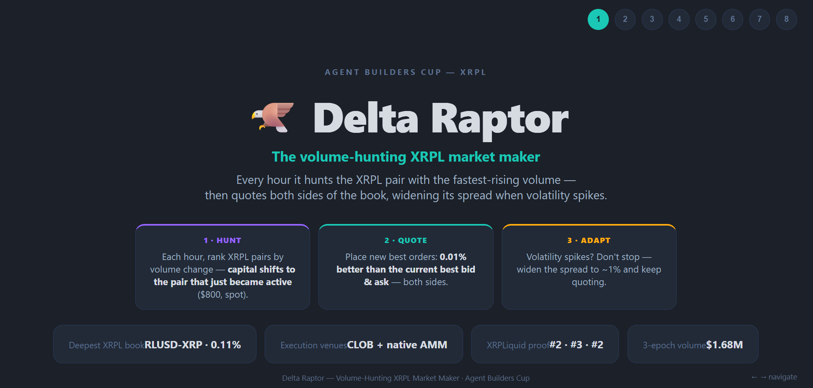

# Delta Raptor — Volume-Hunting Market Maker



A volume-hunting market maker on the XRPL native CLOB with **two hunting modes**.

- **Mode 1 · Race (incentivized):** park the **$800** envelope where volume just spiked (≥3×), sit new best both sides, never leave.
- **Mode 2 · Harvest (unincentivized, default):** **$100 BUY** live, **$700 idle**, SELL unlocks on fill; hunt still flies the live perch.

Fair value from Binance XRP-USDT, never the ledger mid. Widen ~1% on a spike (Mode 2: the $100, not the envelope). Inventory turns only through the cheaper of CLOB vs native AMM, ≤ 25 bps, live perch only.

## What it is

- **Strategy type:** Agent — AI/autonomous trading agent (LLM tunes 1 action / 300s; Hummingbot `pmm_simple` quotes, no LLM in the quote loop)
- **Venue:** XRPL native DEX (CLOB) + native AMM rebalance
- **Core:** RLUSD-XRP (Ripple RLUSD `rMxCKbEDwqr76QuheSUMdEGf4B9xJ8m5De`); rotation only after `FULL_SHIFT`
- **Tick:** 300s LLM tick; `pmm_simple` requotes every 30s
- **Envelope:** $800 ceiling — Race parks all; Harvest parks $100, idle $700 off-book
- **Hedge:** off

## Run

```bash
./.venv/bin/python agents/delta_raptor/tests/validate_agent.py
./.venv/bin/pytest agents/delta_raptor/tests/ -q
```

Drop `agents/delta_raptor/` into a Condor checkout. Not a Hummingbot/Condor fork. Do not commit sessions, wallets, or `.env`.
