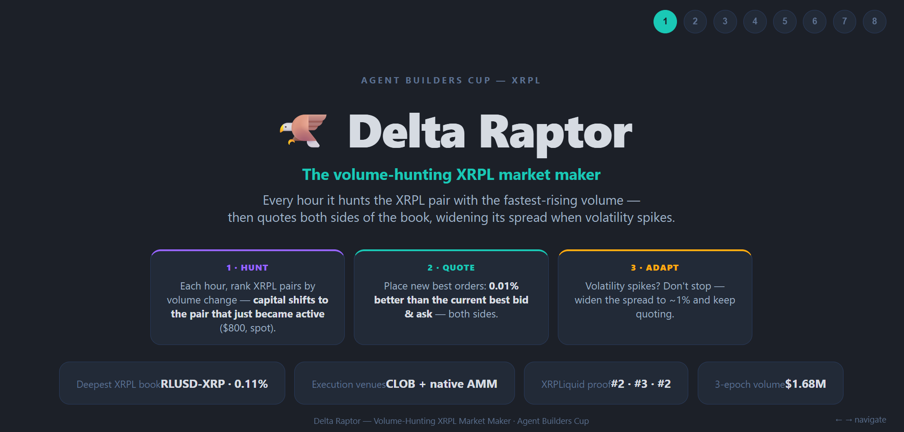

# Delta Raptor — Dual-Arm Builders Cup Entry ($800)



**Organizers: fund two separate sleeves. Do not put the full $800 on XRPL.**

| Arm | Share | Amount | Venue | What to fund | Runs as |
|---|---|---|---|---|---|
| **Volume** | **70%** | **~$560** | Binance (USD1 / stable desk) | Spot stable inventory on the Binance account used by Hummingbot | Controller `raptor_usd_desk` |
| **P&L** | **30%** | **~$240** | XRPL DEX | XRPL wallet (RLUSD + XRP) for harvest MM | Condor agent loop `rlusd_xrp_maker` + controller `delta_raptor_pmm` |

**Entry envelope:** **$800** total.  
**P&L live toehold:** ~**$80** of the $240 sleeve is quoted; the rest of the P&L sleeve stays idle unless a rare hunt hop fires.  
**Default mode:** `hunting_mode: harvest` (patient P&L). Full-envelope XRPL **race** is **off** unless explicitly restored.

Source of truth for numbers: `agents/delta_raptor/routines/_delta_raptor_alloc.py` and [`ORGANIZER_CAPITAL.md`](ORGANIZER_CAPITAL.md).

---

## What it is

- **Strategy type:** Condor agent + Hummingbot controllers (dual-arm)
- **P&L venue:** XRPL native CLOB (RLUSD-XRP core) + cost-gated AMM rebalance
- **Volume venue:** Binance stable desk (`raptor_usd_desk`) — continuous 1-sided skew + maker timeout→cross
- **Mark for XRPL quotes:** Binance perpetual `XRP-USDT` (never ledger mid)
- **Tick:** 300s agent tick; `delta_raptor_pmm` requotes every 5 min or on >0.5% drift (60s check, coded)
- **Hedge:** off

---

## Organizer funding checklist

1. **Create / use two funding destinations**
   - Binance spot account for the volume arm (~$560 USD1 or equivalent stable pair the desk is configured for)
   - XRPL wallet for the P&L arm (~$240 in RLUSD/XRP on the live books)
2. **Wire connectors** in Hummingbot API: `binance` (or the desk’s configured connector) + `xrpl` + a CEX mark feed (`binance_perpetual` XRP-USDT by default)
3. **Install controllers**
   - `agents/delta_raptor/controllers/delta_raptor_pmm/` → Hummingbot controllers package path
   - `agents/delta_raptor/controllers/generic/raptor_usd_desk.py` → Hummingbot `controllers/generic/`
4. **Install agent:** copy `agents/delta_raptor/` into Condor `agents/`
5. **Start volume arm** as a Hummingbot bot/controller instance sized ~$560 (see `conf/raptor_usd_desk.sample.yml`)
6. **Start P&L arm** from Condor: **Delta Raptor → RLUSD XRP Maker** (defaults already set to $240 / harvest / toehold $80)

Do **not** start the P&L loop with `total_amount_quote: 800` or `hunting_mode: race` for dual-arm finals.

---

## Run checks (no trading)

```bash
./.venv/bin/python agents/delta_raptor/tests/validate_agent.py
./.venv/bin/pytest agents/delta_raptor/tests/ -q
```

Drop-in package only — **not** a Hummingbot/Condor fork. Do not commit sessions, wallets, or `.env`.

---

## Layout

```
agents/delta_raptor/
  AGENT.md                         # identity + dual-arm philosophy
  routines/_delta_raptor_alloc.py  # $800 / $560 / $240 / $80 constants
  loops/rlusd_xrp_maker/loop.md    # P&L tick playbook (harvest defaults)
  controllers/delta_raptor_pmm/    # XRPL P&L quoter
  controllers/generic/raptor_usd_desk.py  # Binance volume desk
ORGANIZER_CAPITAL.md               # funding table for ops
conf/raptor_usd_desk.sample.yml    # volume-arm sample sizing
```

---

## Modes (do not mix in one deploy)

| Mode | When | Capital behaviour |
|---|---|---|
| **Harvest (default)** | Dual-arm finals | ~$80 toehold on XRPL inside $240 P&L sleeve; volume on Binance |
| **Race** | Cup-only / explicit override | Full envelope on XRPL — **not** the dual-arm default |

Fair value from Binance XRP-USDT. Widen ~1% on a thin/spike book (toehold size, not the whole wallet). Inventory turns only through cheaper of CLOB vs AMM, ≤25 bps, live perch only.
